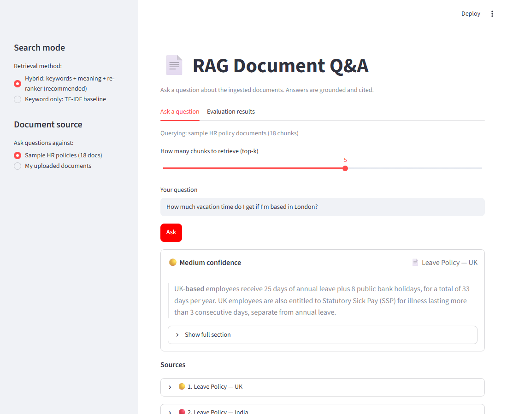
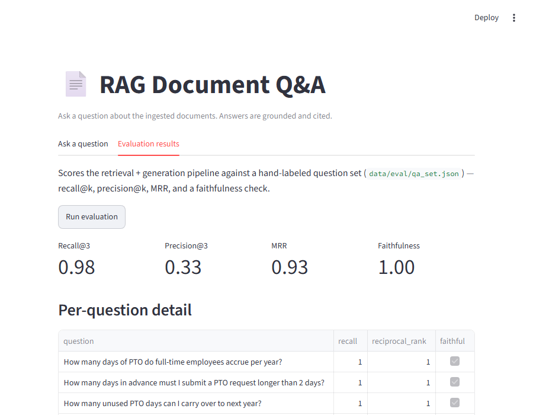

# RAG Document Q&A with a Measured Evaluation Harness

[](https://github.com/omiee1234/rag-document-qa/actions/workflows/tests.yml)

**[Live demo](https://rag-document-app-gwtmqkhdbmr4jpohhdzjhw.streamlit.app/)**
— ask natural-language questions over 18 sample HR policy documents, or
upload your own (PDF/TXT/MD), and get answers with citations to the exact
source chunk — and, unlike most RAG demos, a harness that actually
*measures* whether the retrieval and the answers are any good, against a
hand-labeled question set.

Uploaded documents are indexed entirely in memory, per browser session --
nothing is written to disk, and one visitor's uploads are never visible to
another's (important on a shared, multi-visitor Streamlit Cloud instance).
The evaluation harness always runs against the sample corpus, since the
hand-labeled answer key was written for that specific set of documents.

Uploaded documents get their own automatic quality signal instead:

- **Header/footer stripping** (`loaders.py`): lines that repeat in the
  top/bottom of many pages (company address, product/UIN line, page
  numbers) are removed, keeping one copy. On a real 25-page insurance PDF
  this removed ~15% of the text as boilerplate and cut the index from 88
  to 75 chunks.
- **Retrieval health check** (`health.py`): right after upload, each
  sampled chunk is queried with a sentence from its own middle; the share
  that comes back in the top 3 is shown in the sidebar. It's an upper bound,
  not an accuracy score, but a low number reliably flags scanned PDFs,
  heavy tables or near-duplicate sections before anyone relies on the
  answers. Measured on the same PDF: 80% without stripping, 88% with it.

## Architecture

```
                    ┌─────────────┐
  docs/*.md,.pdf →  │  loaders.py │ → raw text per document
                    └─────────────┘
                          │
                          ▼
                    ┌─────────────┐
                    │ chunking.py │ → overlapping Chunk objects, stable ids ("doc::0")
                    └─────────────┘
                          │
                          ▼
                    ┌───────────────┐        swappable via --embedder:
                    │ embeddings.py │  ←──   tfidf | sentence-transformers | openai
                    └───────────────┘
                          │
                          ▼
                    ┌─────────────┐
                    │  store.py   │  in-memory numpy cosine similarity
                    └─────────────┘  (swap-in path: pgvector / Qdrant)
                          │
            ┌─────────────┴─────────────┐
            ▼                           ▼
     ┌──────────────┐           ┌──────────────┐
     │ retrieve.py  │           │ evaluate.py  │ ← data/eval/qa_set.json
     │ top-k search │           │ recall/MRR/  │   (hand-labeled ground truth)
     └──────────────┘           │ faithfulness │
            │                   └──────────────┘
            ▼
     ┌──────────────┐
     │ generate.py  │ → answer + citations (LLM if OPENAI_API_KEY set, else extractive)
     └──────────────┘
            │
      ┌─────┴─────┐
      ▼           ▼
  cli.py       api.py (FastAPI: POST /ask)
```

Every arrow that says "swappable" really is: changing embedding provider or
vector store is a one-line/one-module change, everything downstream
(retrieval, generation, evaluation) is unaffected.

## Install

```bash
python -m venv .venv
.venv\Scripts\activate        # Windows
pip install -e .
```

Optional extras:
```bash
pip install -e ".[sentence-transformers]"   # real dense embeddings
pip install -e ".[openai]"                  # LLM-generated answers instead of extractive
pip install -e ".[ui]"                      # Streamlit demo app
pip install -e ".[dev]"                     # pytest
pip install -e ".[screenshots]"             # playwright, for scripts/capture_screenshots.py
```

## Usage

```bash
# 1. Ingest the sample HR policy docs into a TF-IDF index (no API key needed)
ragqa ingest --docs data/docs --index index.pkl --embedder tfidf

# 2. Ask a question
ragqa query "How many days of PTO do I get per year?" --index index.pkl

# 3. Score retrieval + faithfulness against the labeled question set
ragqa evaluate --qa-set data/eval/qa_set.json --index index.pkl --quiet

# 4. Serve it
export RAGQA_INDEX_PATH=index.pkl        # Windows: set RAGQA_INDEX_PATH=index.pkl
uvicorn ragqa.api:app --reload
# POST http://127.0.0.1:8000/ask  {"question": "..."}
```

Run the test suite:
```bash
pytest tests/ -q
```

## Web UI

A small Streamlit app on top of the same pipeline — ask a question against
the sample corpus or your own uploaded documents, see the grounded answer
with its cited source chunks, or run the evaluation harness with one click
and see recall@k/precision@k/MRR/faithfulness as live metrics. Free, local,
no API key required.

```bash
pip install -e ".[ui]"
streamlit run src/ragqa/ui.py
# opens at http://localhost:8501
```

**Ask a question** — a question box, the grounded answer, and expandable
cited chunks with their similarity scores:



**Evaluation results** — one button, then Recall@3/Precision@3/MRR/
Faithfulness as metric tiles plus a per-question results table:



## Docker

```bash
docker build -t ragqa:latest .
docker run -d -p 8000:8000 --name ragqa ragqa:latest
curl -X POST http://127.0.0.1:8000/ask -H "Content-Type: application/json" \
  -d '{"question": "How many days of PTO do I get?"}'
```

The image ingests the sample docs at build time, so the container is ready
to serve as soon as it starts.

## Evaluation results

Measured against the 50-question labeled set in `data/eval/qa_set.json`,
against 18 documents (top-k = 3). The corpus deliberately includes
near-duplicate policies across regions/teams (leave policy variants for
US/UK/India, remote-work variants for engineering/sales, etc.) that share
heavy vocabulary, plus a handful of paraphrased questions that avoid the
source document's literal wording:

| Embedding | Recall@3 | Precision@3 | MRR | Faithfulness |
|---|---|---|---|---|
| TF-IDF (baseline) | 0.98 | 0.33 | 0.93 | 1.00 |
| sentence-transformers (`all-MiniLM-L6-v2`) | 0.98 | 0.33 | 0.96 | 1.00 |

**What actually happened, question by question:**

- TF-IDF missed *"How much vacation time do I get if I'm based in
  London?"* — the correct chunk (`leave_policy_uk::0`) never mentions
  "vacation" or "London," only "leave" and "UK," so the literal
  bag-of-words match failed and it retrieved unrelated policies instead.
  This is the textbook vocabulary-mismatch failure mode of lexical
  retrieval.
- sentence-transformers, in turn, missed a very literal question —
  *"Within how many hours must a suspected security incident be
  reported?"* — retrieving onboarding/remote-work chunks instead of the
  security policy. Dense embeddings aren't strictly better; they trade
  one failure mode for a different one.

This is the actual point of building an eval harness instead of eyeballing
a demo: the aggregate numbers alone (0.98 vs 0.98 recall) would suggest
"no difference," but the *specific failures* reveal a real, defensible
trade-off — TF-IDF is vulnerable to paraphrasing, dense embeddings aren't
immune to short, keyword-heavy technical questions on a small corpus.
Precision@3 is capped at 0.33 by construction: each document is a single
chunk, so 1 correct chunk out of top-3 retrieved is the ceiling.

**A third failure mode, found testing against real-world uploaded PDFs
(legal/insurance forms, not the sample corpus):** TF-IDF can rank a
document's actual answer *below* other chunks that repeat the same
keyword as boilerplate. A multi-page proposal form that asks the same
"Name of the Proposer" signature-block label in several unrelated
sections (translator declaration, intermediary declaration, etc.) will
often outrank the one chunk that actually has the label *and* the filled-
in value next to it — because bag-of-words scoring can't distinguish "this
word appears near the answer" from "this word appears as a repeated
template label with no answer nearby." The correct chunk was still
retrievable, just ranked 4th instead of 1st-3rd — which is why the UI and
CLI's default top-k was raised from 3 to 5, as a partial mitigation. A
real fix would need hybrid retrieval with a re-ranker, not just a bigger
top-k; see Possible extensions.

## Project layout

```
src/ragqa/       pipeline modules (see architecture diagram above)
data/docs/       sample source documents
data/eval/       labeled question -> correct_chunk_ids set
tests/           pytest unit tests for chunking, store, evaluation math
Dockerfile       builds the index at image build time, serves /ask
```

## Possible extensions

Not built, but straightforward additions if useful:

- A real pgvector or Qdrant backend in place of the in-memory store
  (the swap-in path is documented in `store.py` but not implemented)
- LLM-as-judge faithfulness checking, as an alternative to the current
  word-overlap heuristic
- Hybrid retrieval (lexical + dense, reranked) to address both failure
  modes documented above instead of picking one embedder
